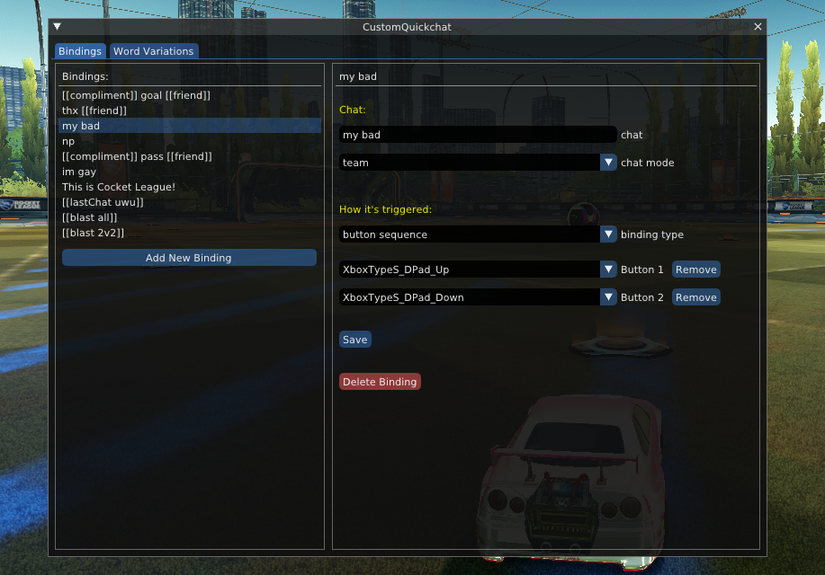
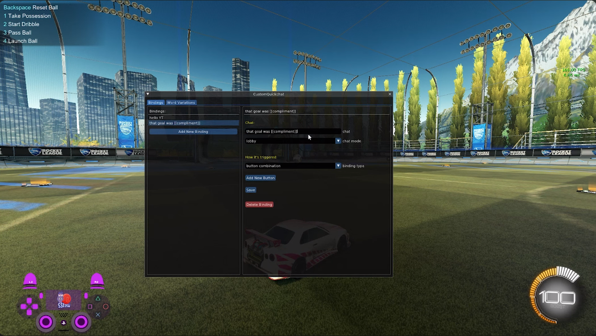

# Custom Quickchat (BakkesMod plugin)

Enables custom quickchats in Rocket League

 

Chats are sent through the native Rocket League chat system ✔️
  - Better than using a script + macros to simulate keypresses, which is error prone and hacky (temporarily blocks gameplay inputs while chats are typed out)

## Video Tutorial

https://youtu.be/P4UZTl09oYo

## Installation

Find the latest version in [Releases](https://github.com/smallest-cock/CustomQuickchat/releases)

## Usage

1. In plugin settings, click `Open Bindings Menu` to edit chat bindings and word variations
    - check out the [Settings guide](./docs/Settings.md) for all the special features

2. Click `Save` when you're finished
     
3. Flex your sick ass chats 😎
   
 

### Commands

| Command | Description | Preferred usage |
|---|---|:---:|
`cqc_toggle_enabled` | toggle custom quickchats on/off | key bind
`cqc_forfeit` | forfeit the current match | key bind
`cqc_show_path_directories` | list the directories in your PATH variable (helpful for speech-to-text troubleshooting) | console
`cqc_list_bindings` | list all your current RL bindings | console

You can run these commands in the bakkesmod console window (F6), or bind them to a key

## Credits

Inspired by Blaku's [CustomBindingPlugin](https://github.com/blaku-rl/CustomBindingPlugin)
