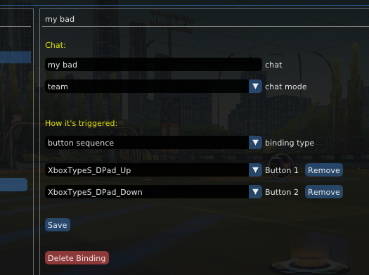
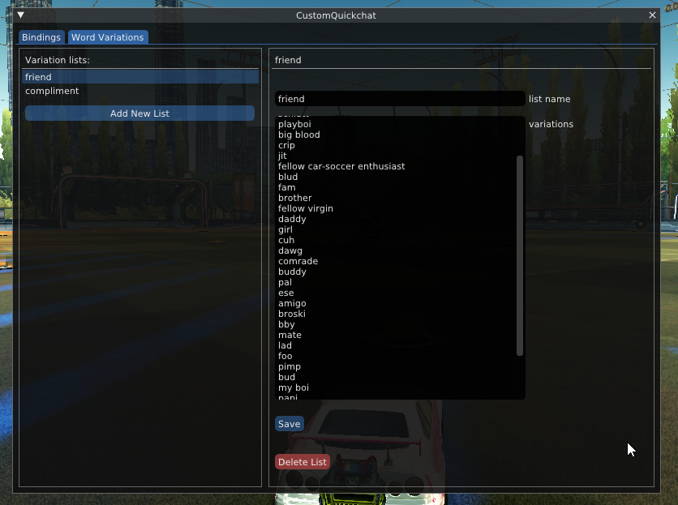
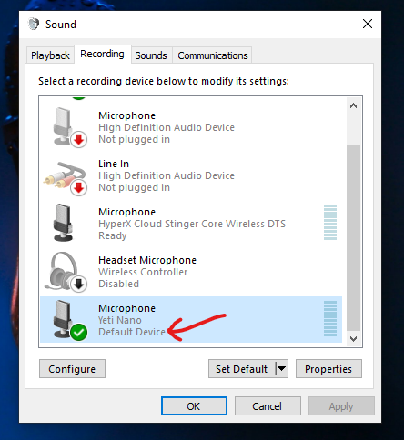

# Settings Guide

## Bindings

You can either create **button combination** bindings (buttons pressed at the same time), or **button sequence** bindings (buttons pressed in a sequence).

>[!IMPORTANT]
>Button sequence bindings must contain exactly 2 buttons!

## Chats



Customize the chat, the chat mode, and how it will be triggered.

### Word Variations



Create your own word variation lists in the `Word Variations` tab. Choose a name for the list, then add words in the `variations` section. Each word must be separated by a new line (hence the long text box)

When you're done editing, click `Save`

Then use `[[variation list name]]` syntax in your chats to include your word variations.

**For example:** A chat set up as `hello [[friend]]` will evaluate to: `hello homie` or `hello my guy` etc. based on whatever words/phrases are put in the `friend` variation list.

 - Word variation lists must be at least 3 words long (preferrably 4+)

 - Word variations are chosen randomly from the list... so it's always a surprise 😊


## Special Effects

Similar to variations, you can include these keywords in your chat to trigger special functionality. 

- The `blast` and `lastChat` keywords require the [Lobby Info plugin](https://github.com/smallest-cock/LobbyInfo) to be installed


>[!TIP]
>Don't name your word variation lists the same as these

| keyword | description |
|:---|:---:|
`[[menu]]` | exit to the main menu
`[[forfeit]]` | forfeit the current match
`[[blast 1v1]]` | blast the last chatter's 1v1 rank and # of games played
`[[blast 2v2]]` | blast the last chatter's 2v2 rank and # of games played
`[[blast 3v3]]` | blast the last chatter's 3v3 rank and # of games played
`[[blast casual]]` | blast the last chatter's # of casual games played
`[[blast all]]` | blast the last chatter's ranks across all playlists
`[[lastChat]]` | returns the last chat sent in the lobby (depends on your Lobby Info settings)
`[[lastChat sarcasm]]` | returns the last chat iN sArCAsM tExT
`[[lastChat uwu]]` | returns the last chat in UωU text ≽^•⩊•^≼ 👉👈 ( ˶ˆ꒳ˆ˵ )
`[[speechToText]]` | start listening for speech-to-text, then send the result in chat
`[[speechToText sarcasm]]` | start listening for speech-to-text, then send the result in chat (with sarcasm effect)
`[[speechToText uwu]]` | start listening for speech-to-text, then send the result in chat (with UωU effect)

<br>

**For example:** `"[[lastChat]]" - toxic nerd` will wrap the last chatter's chat in quotes, and be displayed as if it were said by a toxic nerd

## Speech-to-text

`[[speechToText]]` uses whatever mic is set as your default input device in Windows sound settings:



**To change the default mic:** select it in the list, then click the `Set Default` button

If you have multiple mics connected, make sure the one you're using in RL is the default device. If you continuously get the `No speech detected from 'microphone' ...` error, try disabling all other active mics from the list.

### Troubleshooting speech-to-text errors:

Most errors will be logged in the `ErrorLog.txt` file (located in the `bakkesmod\data\CustomQuickchat` folder). The log will usually give a good idea of what's causing your issue. For example, if you see this error:

```
[ERROR] Failed to import module: No module named 'pyaudio'
```

that means you dont have the `pyaudio` python package installed. You can fix that by opening a cmd window and running this command:

```
pip install pyaudio
```